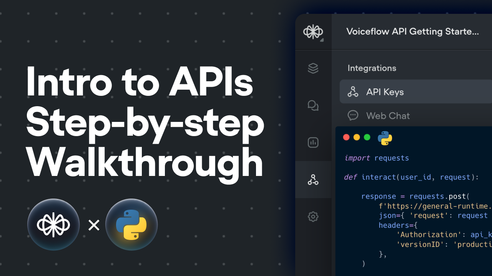

# Voiceflow-Getting-Started-APIs-Guide

Files for the Voiceflow Getting Started with APIs Guide.

You can find the guide [here](https://developer.voiceflow.com/reference/api-guide-start) and the video [here](https://youtu.be/KUqpPeJ6DkQ).

